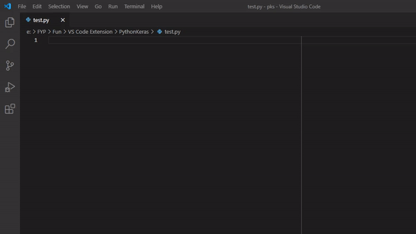

# Keras 2.4.0 Code Snippets for VS code

I found it tedious to rewrite the basic Keras code over and over again. Thats why I built this code snippets to save time.
This extension will solve this issue with a simple `!` + the name of whatever you are looking for.

  

## Commands

### Main Commands

| **Command** | **Description **                                                                                    |
| ----------- | ------------------------------------------------------------------------------------------------- |
| !setup      | Keras 2.4.0 initial setup                |
| !datasetimg | Load custom image dataset from directory                        |
| !datasettext| Load custom textual dataset from directory             |

### Commands for using Keras Datasets

| **Command** | **Description **                                                                                    |
| ----------- | ------------------------------------------------------------------------------------------------- |
| !mnist     | Loads the dataset of 60,000 28x28 grayscale images of the 10 digits, along with a test set of 10,000 images.               |
| !fashion | Loads the dataset of 60,000 28x28 grayscale images of 10 fashion categories, along with a test set of 10,000 images.   |
| !cifar10| Loads the dataset of 50,000 32x32 color training images and 10,000 test images, labeled over 10 categories            |
| !cifar100      | Loads the dataset of 50,000 32x32 color training images and 10,000 test images, labeled over 100 fine-grained classes that are grouped into 20 coarse-grained classes.                          |
| !imbd   | Loads the dataset of 50,000 32x32 color training images and 10,000 test images, labeled over 100 fine-grained classes that are grouped into 20 coarse-grained classes.|
| !boston or !house |Loads the dataset samples containing 13 attributes of houses at different locations around the Boston suburbs in the late 1970s.  |

### Commands for using Keras Optimizers

| **Command** | **Description **                                                                                    |
| ----------- | ------------------------------------------------------------------------------------------------- |
| !sgd     | Keras 2.4.0 SGD  |
| !adam | Keras 2.4.0 Adam|
| !rmsprop| Keras 2.4.0 RMSprop |
| !adadelta     | Keras 2.4.0 Adadelta |
| !adagrad  | LKeras 2.4.0 Adagrad|
| !adamax |Keras 2.4.0 Adamax |
| !nadam |Keras 2.4.0 Nadam  |
| !ftrl | Keras 2.4.0 Ftrl |

### Commands for using Keras Losses

| **Command** | **Description **                                                                                    |
| ----------- | ------------------------------------------------------------------------------------------------- |
| !sparse    |SparseCategoricalCrossentropy  |
| !bin | BinaryCrossentropy|
| !cat | CategoricalCrossentropy|
| !poisson     |  Poisson |
| !binloss  | binary_crossentropy|
| !catloss |categorical_crossentropy |
| !sparseloss |sparse_categorical_crossentropy |
| !poiloss | poisson |
| !kld | KLDivergence |
| !kld | kullback_leibler_divergence |

### Commands for using Keras Accuracy

| **Command** | **Description **                                                                                    |
| ----------- | ------------------------------------------------------------------------------------------------- |
| !acc    | Accuracy  |
| !binaryacc | BinaryAccuracy |
| !catagoricalacc|  CategoricalAccuracy |
| !topkacc     | TopKCategoricalAccuracy |
| !sparseacc | SparseTopKCategoricalAccuracy |

### Commands for using Keras deep learning algorithms

| **Command** | **Description **                                                                                    |
| ----------- | ------------------------------------------------------------------------------------------------- |
| !vgg16    | Extract features with VGG16  |
| !vgg19 | Extract features from an arbitrary intermediate layer with VGG19 |
| !resnet50| Classifies ImageNet classes with ResNet50 |
| !inceptionv3     | Fine-tune InceptionV3 on a new set of classes |
| !inceptionv3custom | Build InceptionV3 over a custom input tensor |

### Commands for using Keras Transfer Learning Boiler plate of different algorithms

| **Command** | **Description **                                                                                    |
| ----------- | ------------------------------------------------------------------------------------------------- |
| !vgg16tl   | Transfer Learning using VGG16  |
| !vgg19tl | Transfer Learning using VGG19 |
| !resnet50tl| Transfer Learning using ResNet50 |
| !inceptionv3tl     | Transfer Learning using |

## Requirements
`Python 3.5–3.8`, `Tensorflow 2` and `Keras`

## Known Issues

No known issues so far.

## Release Notes

### 1.0.0

Initial release of Keras 2.4.0 Code Snippets

-----------------------------------------------------------------------------------------------------------

